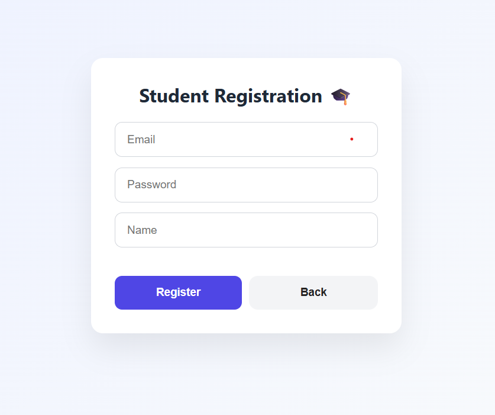
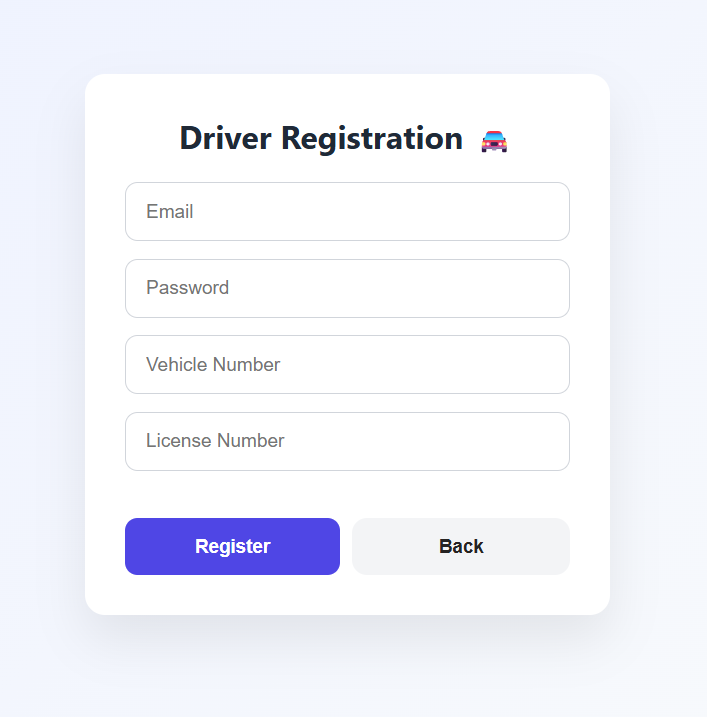
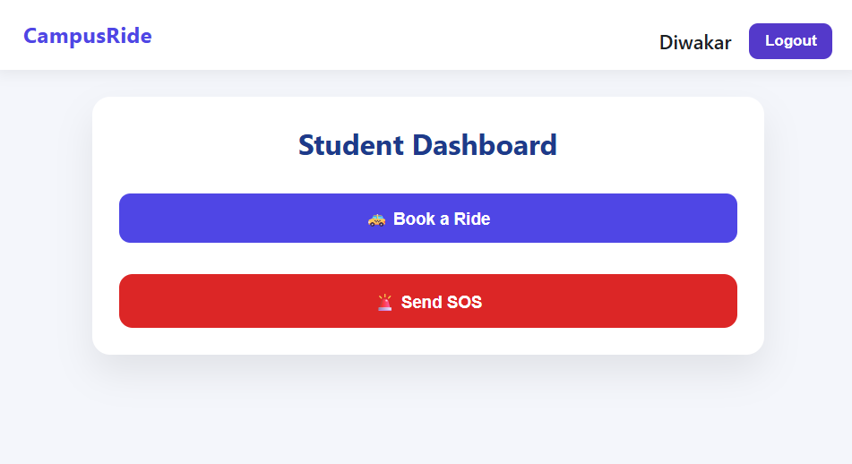
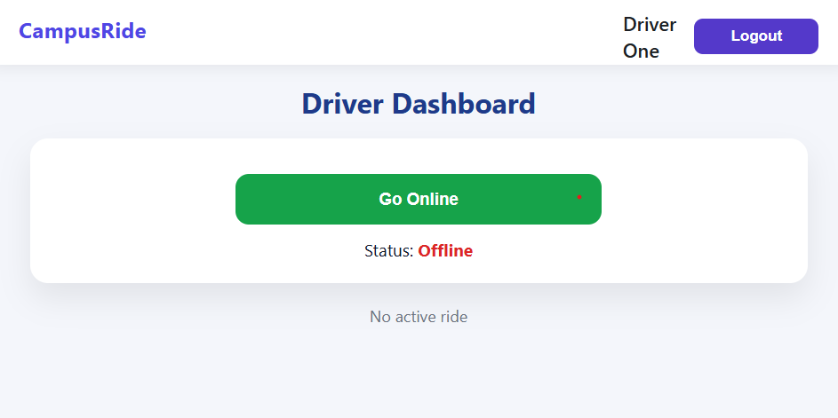
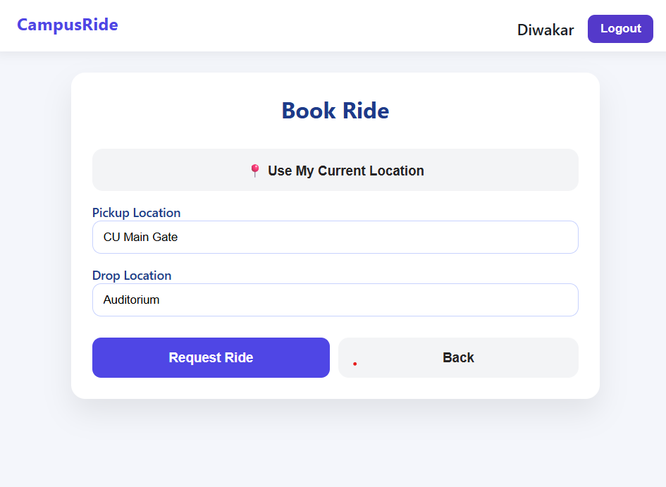
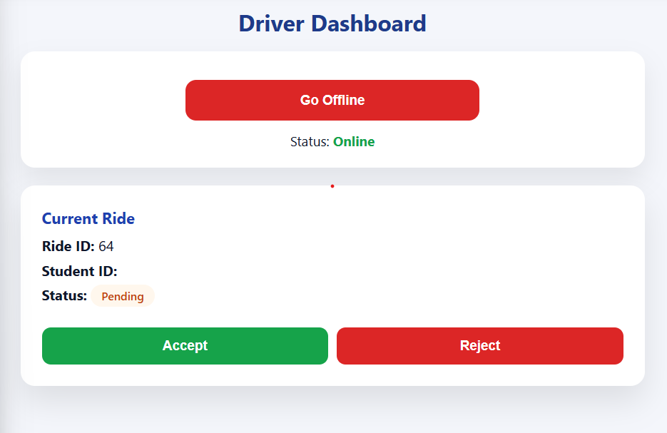
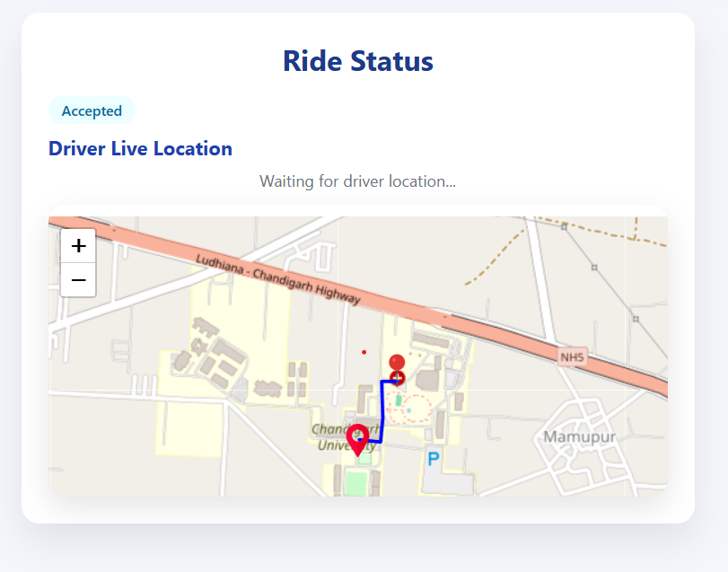

# 🚕 Campus Ride – University Ride Management System

Campus Ride is a **university-focused ride booking and management system** built to operate **inside a campus environment**.  
It enables students to book rides, drivers to accept and manage rides, and admins to monitor SOS alerts and live activity.

🌐 **Live Demo (Frontend)**  
👉 https://campus-ride-theta.vercel.app/

---
## 📸 Screenshots

# Student Register

# Driver Register

# Student Home

# Driver Home

# Book Ride

# Ride Request

# Live Status

---

## ✨ Features

### 👩‍🎓 Student
- Register & login using JWT authentication
- Book rides inside the university campus
- Select **pickup & drop points** from predefined campus locations
- Live ride status tracking
- Real-time driver location updates (WebSockets)
- SOS emergency alert system

### 🚗 Driver
- Driver registration with vehicle & license details
- Go online/offline
- Accept / reject ride requests
- Update live location during a ride
- Complete rides with status updates

### 🛡️ Admin
- View active SOS alerts
- Monitor ride activity
- Bus tracking support (future extension)

---

## 🧠 Tech Stack

### Frontend
- **React (Vite)**
- **Axios**
- **Leaflet & React-Leaflet** (Live Maps)
- **CSS (custom UI & animations)**
- Deployed on **Vercel**

### Backend
- **Django**
- **Django REST Framework**
- **JWT Authentication (SimpleJWT)**
- **Django Channels (WebSockets)**
- **SQLite (development / demo)**
- Deployed on **Render**

---

## 🗺️ Live Maps & Real-Time Tracking

- Driver live location updates using **WebSockets**
- Smooth marker movement on map
- Pickup → Drop route visualization
- Campus-restricted location selection

---

## 🚨 SOS System

- Students can trigger SOS with live GPS coordinates
- SOS stored securely in backend
- Admin can view all active SOS alerts
- Designed for **campus safety use-cases**

---

